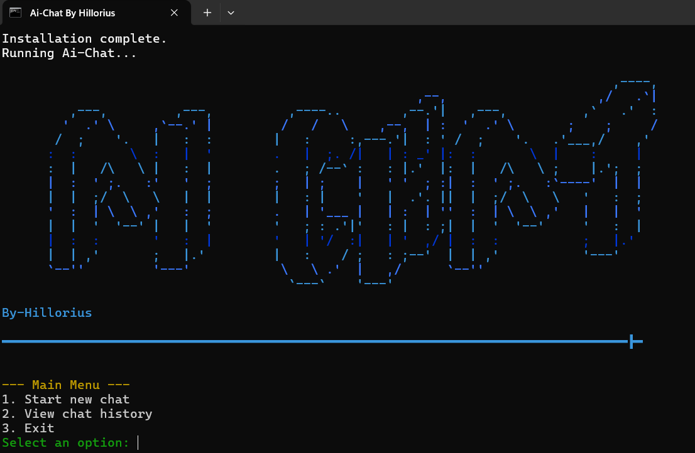

# AIChat

AIChat is an interactive chat application that uses AI to simulate real-time conversations. This project leverages natural language processing to understand user inputs and generate contextual responses.

## Features

- **Intent Matching**: The application can understand user input by matching it to predefined intents.
- **Real-Time Response Simulation**: Responses are displayed in real-time, creating a more engaging user experience.
- **Customizable AI Personality**: Users can set an initial prompt to define the personality of the AI.
- **Supports *NSFW***: The AI can infact generates Not Safe For Work (*NSFW*) Responds.

## Installation

Requirements :
- [colorama](https://pypi.org/project/colorama/)
- [json](https://docs.python.org/3/library/json.html) (part of the Python standard library)
- [re](https://docs.python.org/3/library/re.html) (part of the Python standard library)
- [requests](https://pypi.org/project/requests/)

- **Dont worry the .bat files automaticly install the requirements if you already have *pip*.**
